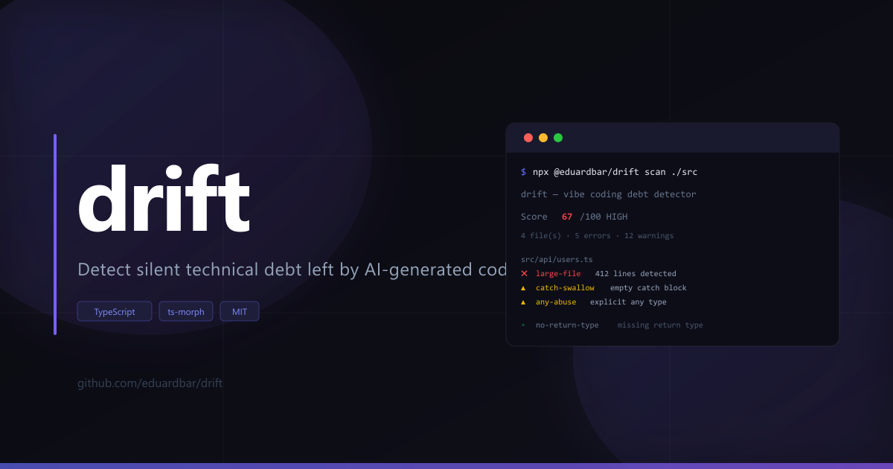

# drift

AI Code Audit CLI for AI-assisted PRs. Drift turns static signals into merge trust decisions before you merge.


[Why](#why) · [Installation](#installation) · [Product Docs](#product-docs) · [Commands](#commands) · [Rules](#rules) · [Score](#score) · [Configuration](#configuration) · [CI Integration](#ci-integration) · [drift-ignore](#drift-ignore) · [Contributing](#contributing)

---

## Why

AI coding tools ship code fast. They also leave behind consistent, predictable structural patterns that accumulate silently: files that grow to 600 lines, catch blocks that swallow errors, exports that nothing imports, functions duplicated across three modules because the model regenerated instead of reusing.

GitClear's 2024 analysis of 211M lines of code found a **39.9% drop in refactoring activity** and an **8x increase in duplicated code blocks** since AI tools became mainstream. A senior engineer on r/vibecoding put it plainly: _"The code looks reviewed. It isn't. Nobody's reading 400-line files the AI dumped in one shot."_

drift gives you debt signals (`scan`, `review`) and a trust decision layer (`trust`) so teams can merge with confidence instead of guesswork.

**How drift compares to existing tools:**

| Tool | What it does | What it misses |
|------|--------------|----------------|
| ESLint | Correctness and style within a single file | Structural patterns, cross-file dead code, architecture violations |
| SonarQube | Enterprise-grade static analysis | Costs money, requires infrastructure, overwhelming for small teams |
| drift | Structural debt + AI-specific patterns + cross-file analysis + 0–100 score | Not a linter — does not replace ESLint |

---

## Installation

```bash
# Run without installing
npx @eduardbar/drift scan .

# Install globally
npm install -g @eduardbar/drift

# Install as a dev dependency
npm install --save-dev @eduardbar/drift
```

---

## Product Docs

- Product requirements and roadmap: [`docs/PRD.md`](./docs/PRD.md)
- Trust core release checklist: [`docs/trust-core-release-checklist.md`](./docs/trust-core-release-checklist.md)
- Contributor/agent workflow guide: [`docs/AGENTS.md`](./docs/AGENTS.md)

---

## Commands

### `drift scan [path]`

Scan a directory and print a scored report to stdout.

```bash
drift scan .
drift scan ./src
drift scan ./src --output report.md
drift scan ./src --json
drift scan ./src --ai
drift scan ./src --fix
drift scan ./src --min-score 50
drift scan ./src --low-memory --max-file-size-kb 1024
```

**Options:**

| Flag | Description |
|------|-------------|
| `--output <file>` | Write Markdown report to a file instead of stdout |
| `--json` | Output raw `DriftReport` JSON |
| `--ai` | Output structured JSON optimized for LLM consumption (Claude, GPT, etc.) |
| `--fix` | Print inline fix suggestions for each detected issue |
| `--min-score <n>` | Exit with code 1 if the overall score meets or exceeds this threshold |
| `--low-memory` | Analyze files in bounded chunks to reduce peak RAM |
| `--chunk-size <n>` | Files per chunk in low-memory mode (default: 40) |
| `--max-files <n>` | Soft cap on analyzed files; extra files are skipped with diagnostics |
| `--max-file-size-kb <n>` | Skip oversized files with diagnostics to avoid OOM |
| `--with-semantic-duplication` | Keep semantic duplication rule enabled in low-memory mode |

**Example output:**

```
  drift  —  technical debt detector
  ──────────────────────────────────────────────────

  Score   █████████████░░░░░░░  67/100  HIGH
  4 file(s) with issues  ·  5 errors  ·  12 warnings  ·  3 info  ·  18 files clean

  Top issues:  debug-leftover ×8  ·  any-abuse ×5  ·  no-return-type ×3

  ──────────────────────────────────────────────────

  src/api/users.ts (score 85/100)
    ✖ L1    large-file              File has 412 lines (threshold: 300)
    ▲ L34   debug-leftover          console.log left in production code
    ▲ L89   catch-swallow           Empty catch block silently swallows errors
    ▲ L201  any-abuse               Explicit 'any' type detected

  src/utils/helpers.ts (score 70/100)
    ✖ L12   duplicate-function-name 'formatDate' looks like a duplicate
    ▲ L55   dead-code               Unused import 'debounce'
```

---

### `drift diff [ref]`

Compare the current project state against any git ref. Defaults to `HEAD~1`.

```bash
drift diff                # HEAD vs HEAD~1
drift diff HEAD~3         # HEAD vs 3 commits ago
drift diff main           # HEAD vs branch main
drift diff abc1234        # HEAD vs a specific commit
drift diff --json         # Output raw JSON diff
```

**Options:**

| Flag | Description |
|------|-------------|
| `--json` | Output raw JSON diff |

Shows score delta, issues introduced, and issues resolved since the given ref.

---

### `drift review`

Review drift against a git base ref and output a PR-ready markdown comment.

```bash
drift review --base origin/main
drift review --base main --comment
drift review --base HEAD~3 --json
drift review --base origin/main --fail-on 5
```

| Flag | Description |
|------|-------------|
| `--base <ref>` | Git base ref to compare against (default: `origin/main`) |
| `--json` | Output structured review JSON |
| `--comment` | Print only the markdown body for PR comments |
| `--fail-on <n>` | Exit code 1 when score delta is greater than or equal to `n` |

`drift review` is best used as supplementary diff context alongside `drift trust` in pull-request workflows.

---

### `drift trust [path]`

Compute merge trust baseline for local checks and CI merge gates.

```bash
drift trust
drift trust ./src
drift trust ./src --json
drift trust ./src --base origin/main
drift trust ./src --base origin/main --markdown
drift trust ./src --markdown --output trust.md
drift trust ./src --min-trust 45
drift trust ./src --max-risk HIGH
drift trust ./src --branch main
drift trust ./src --branch release/v1.4.0 --policy-pack strict --explain-policy
drift trust ./src --advanced-trust
drift trust ./src --advanced-trust --previous-trust ./artifacts/prev-trust.json
drift trust ./src --advanced-trust --history-file ./drift-history.json --markdown
```

| Flag | Description |
|------|-------------|
| `--base <ref>` | Compare against a git base ref and include deterministic diff-aware penalties/bonuses |
| `--json` | Output structured trust JSON (`trust_score`, `merge_risk`, `top_reasons`, `fix_priorities`, optional `diff_context`) |
| `--markdown` | Output PR-ready markdown trust summary |
| `--output <file>` | Write selected trust output format to file |
| `--min-trust <n>` | Exit code 1 when trust score is below `n` |
| `--max-risk <level>` | Exit code 1 when computed merge risk exceeds `LOW`, `MEDIUM`, `HIGH`, or `CRITICAL` |
| `--branch <name>` | Branch used for `drift.config` trust policy matching (falls back to CI env vars) |
| `--policy-pack <name>` | Optional trust policy pack from `trustGate.policyPacks` in `drift.config.*` |
| `--explain-policy` | Print base/pack/branch/override resolution and effective gate policy to stderr |
| `--advanced-trust` | Enable optional advanced trust layer (historical comparison + team guidance metadata) |
| `--previous-trust <file>` | Compare current trust against a prior trust JSON file in advanced mode |
| `--history-file <file>` | Use a specific `drift-history.json` file for advanced historical fallback |

When `trustGate` policy is configured in `drift.config.*`, branch-based thresholds are applied automatically. CLI flags still override policy values.

---

### `drift trust-gate <trust-json-file>`

Evaluate trust gate thresholds from a previously generated trust JSON file. This is ideal for CI workflows that already produced `drift-trust.json` and want a single source of truth for gate logic.

```bash
drift trust-gate drift-trust.json --min-trust 45 --max-risk HIGH
drift trust-gate drift-trust.json --branch release/v1.2.0
drift trust-gate drift-trust.json --branch main --policy-pack balanced --explain-policy
```

| Flag | Description |
|------|-------------|
| `--min-trust <n>` | Exit code 1 when trust score in JSON is below `n` |
| `--max-risk <level>` | Exit code 1 when merge risk in JSON exceeds `LOW`, `MEDIUM`, `HIGH`, or `CRITICAL` |
| `--branch <name>` | Branch used for `drift.config` trust policy matching (falls back to CI env vars) |
| `--policy-pack <name>` | Optional trust policy pack from `trustGate.policyPacks` in `drift.config.*` |
| `--explain-policy` | Print base/pack/branch/override resolution and effective gate policy to stderr |

---

### `drift kpi <path>`

Aggregate trust KPI evidence from local artifacts (directory or glob). Prints a compact console summary to stderr and structured KPI JSON to stdout.

```bash
drift kpi ./artifacts/trust
drift kpi "./artifacts/**/drift-trust-*.json"
drift kpi ./artifacts/trust --no-summary
```

| Flag | Description |
|------|-------------|
| `--no-summary` | Disable stderr console summary and output JSON only |

Computed KPI fields include:
- PRs evaluated count
- Merge risk distribution (`LOW`, `MEDIUM`, `HIGH`, `CRITICAL`)
- Trust score average/median/min/max
- High-risk ratio (`HIGH` + `CRITICAL`)
- Diff trend aggregates when `diff_context` exists (`scoreDelta`, new/resolved issues, status distribution)
- Diagnostics for malformed/missing/invalid JSON artifacts

---

### `drift map [path]`

Generate an `architecture.svg` map with inferred layer dependencies. When layer config is present, the SVG also highlights cycle edges and layer violations.

```bash
drift map
drift map ./src
drift map ./src --output docs/architecture.svg
```

| Flag | Description |
|------|-------------|
| `--output <file>` | Output path for the SVG file (default: `architecture.svg`) |

Edge legend in SVG:
- Gray: normal dependency
- Orange: cycle edge
- Red: layer violation edge

---

### `drift report [path]`

Generate a self-contained HTML report. No server required — open in any browser.

```bash
drift report              # scan current directory
drift report ./src        # scan specific path
drift report ./src --output my-report.html
```

**Options:**

| Flag | Description |
|------|-------------|
| `--output <file>` | Output path for the HTML file (default: `drift-report.html`) |

All styles and data are embedded inline in the output file.

---

### `drift badge [path]`

Generate a `badge.svg` with the current score, compatible with shields.io style.

```bash
drift badge               # writes badge.svg to current directory
drift badge ./src
drift badge ./src --output ./assets/drift-badge.svg
```

**Options:**

| Flag | Description |
|------|-------------|
| `--output <file>` | Output path for the SVG file (default: `badge.svg`) |

Add the badge to your README — see [README Badge](#readme-badge).

---

### `drift ci [path]`

Emit GitHub Actions annotations and a step summary. Designed to run inside a CI workflow.

```bash
drift ci                  # scan current directory
drift ci ./src
drift ci ./src --min-score 60
```

**Options:**

| Flag | Description |
|------|-------------|
| `--min-score <n>` | Exit with code 1 if the overall score meets or exceeds this threshold |

Outputs `::error` and `::warning` annotations visible in the PR diff. Writes a markdown summary to `$GITHUB_STEP_SUMMARY`.

---

### `drift trend [period]`

Show score evolution over time. `period` accepts: `week`, `month`, `quarter`, `year`.

```bash
drift trend week
drift trend month
drift trend quarter --since 2025-01-01
drift trend year --until 2025-12-31
```

**Options:**

| Flag | Description |
|------|-------------|
| `--since <date>` | Start date for the trend window (ISO 8601) |
| `--until <date>` | End date for the trend window (ISO 8601) |

---

### `drift blame [target]`

Identify which files, rules, or contributors are responsible for the most debt. `target` accepts: `file`, `rule`, `overall`.

```bash
drift blame file          # top files by score
drift blame rule          # top rules by frequency
drift blame overall
drift blame file --top 10
```

**Options:**

| Flag | Description |
|------|-------------|
| `--top <n>` | Limit output to top N results (default: 5) |

---

### `drift fix [path]`

Auto-fix safe issues with explicit preview/write modes.

```bash
drift fix ./src --preview
drift fix ./src --write
drift fix ./src --write --yes
drift fix ./src --dry-run   # alias of --preview
```

| Flag | Description |
|------|-------------|
| `--preview` | Preview before/after without writing files |
| `--write` | Apply fixes to disk |
| `--dry-run` | Backward-compatible alias for preview mode |
| `--yes` | Skip interactive confirmation for write mode |

---

### `drift cloud`

Local multi-tenant foundations backed by `.drift-cloud/store.json`.

```bash
drift cloud ingest ./src --org acme --workspace core --user u-123 --role owner --plan sponsor --repo webapp
drift cloud summary
drift cloud summary --org acme --workspace core
drift cloud summary --org acme --workspace core --actor u-owner
drift cloud ingest ./src --org acme --workspace core --user u-member --actor u-owner
drift cloud plan-set --org acme --plan team --actor u-owner --reason "annual upgrade"
drift cloud plan-changes --org acme --actor u-owner
drift cloud usage --org acme --actor u-owner
drift cloud summary --json
drift cloud dashboard --output drift-cloud-dashboard.html
```

**Subcommands:**

| Command | Description |
|---------|-------------|
| `drift cloud ingest [path] --org <id> --workspace <id> --user <id> [--role <owner\|member\|viewer>] [--plan <free\|sponsor\|team\|business>] [--repo <name>] [--actor <user>] [--store <file>]` | Scans the path and stores one tenant-scoped snapshot (actor is optional authz context for writes) |
| `drift cloud summary [--json] [--org <id>] [--workspace <id>] [--actor <user>] [--store <file>]` | Shows users/workspaces/repos usage and runs per month, optionally scoped with actor-based read checks |
| `drift cloud plan-set --org <id> --plan <free\|sponsor\|team\|business> --actor <user> [--reason <text>] [--store <file>]` | Updates organization plan and writes an audited plan-change event (owner-gated by actor) |
| `drift cloud plan-changes --org <id> --actor <user> [--json] [--store <file>]` | Lists audited plan lifecycle events for the organization |
| `drift cloud usage --org <id> --actor <user> [--month <yyyy-mm>] [--json] [--store <file>]` | Shows organization usage plus effective limits for current plan |
| `drift cloud dashboard [--output <file>] [--store <file>]` | Generates an HTML dashboard with trends and hotspots |

`drift cloud` ships with tenant identity boundaries (`organizationId` + `workspaceId`), role primitives (`owner`/`member`/`viewer`), and plan placeholders (`free`/`sponsor`/`team`/`business`). It is an infrastructure foundation, not a full auth/billing platform.

By default, local guardrails enforce one plan-based limit: max workspaces per organization (`free:20`, `sponsor:50`, `team:200`, `business:1000`), plus existing free-phase limits (runs per workspace, repos per workspace, retention window).

---

## Rules

26 rules across three severity levels. All run automatically unless marked as requiring configuration.

| Rule | Severity | Weight | What it detects |
|------|----------|--------|-----------------|
| `large-file` | error | 20 | Files exceeding 300 lines — AI generates monolithic files instead of splitting responsibility |
| `large-function` | error | 15 | Functions exceeding 50 lines — AI avoids decomposing logic into smaller units |
| `duplicate-function-name` | error | 18 | Function names that appear more than once (case-insensitive) — AI regenerates helpers instead of reusing them |
| `high-complexity` | error | 15 | Cyclomatic complexity above 10 — AI produces correct code, not necessarily simple code |
| `circular-dependency` | error | 14 | Circular import chains between modules — AI doesn't reason about module topology |
| `layer-violation` | error | 16 | Imports that cross architectural layers in the wrong direction (e.g., domain importing from infra) — requires `drift.config.ts` |
| `debug-leftover` | warning | 10 | `console.log`, `console.warn`, `console.error`, and `TODO` / `FIXME` / `HACK` comments — AI leaves scaffolding in place |
| `dead-code` | warning | 8 | Named imports that are never used in the file — AI imports broadly |
| `any-abuse` | warning | 8 | Explicit `any` type annotations — AI defaults to `any` when type inference is unclear |
| `catch-swallow` | warning | 10 | Empty `catch` blocks — AI makes code not throw without handling the error |
| `comment-contradiction` | warning | 12 | Comments that restate what the surrounding code already expresses — AI over-documents the obvious |
| `deep-nesting` | warning | 12 | Control flow nested more than 3 levels deep — results in code that is difficult to follow |
| `too-many-params` | warning | 8 | Functions with more than 4 parameters — AI avoids grouping related arguments into objects |
| `high-coupling` | warning | 10 | Files importing from more than 10 distinct modules — AI imports broadly without encapsulation |
| `promise-style-mix` | warning | 7 | `async/await` and `.then()` / `.catch()` used together in the same file — AI combines styles inconsistently |
| `unused-export` | warning | 8 | Named exports that are never imported anywhere in the project — cross-file dead code ESLint cannot detect |
| `dead-file` | warning | 10 | Files never imported by any other file in the project — invisible dead code |
| `unused-dependency` | warning | 6 | Packages listed in `package.json` with no corresponding import in source files |
| `cross-boundary-import` | warning | 10 | Imports that cross module boundaries outside the allowed list — requires `drift.config.ts` |
| `hardcoded-config` | warning | 10 | Hardcoded URLs, IP addresses, secrets, or connection strings — AI skips environment variable abstraction |
| `inconsistent-error-handling` | warning | 8 | Mixed `try/catch` and `.catch()` patterns in the same file — AI combines approaches without a consistent strategy |
| `unnecessary-abstraction` | warning | 7 | Wrapper functions or helpers that add no logic over what they wrap — AI over-engineers simple calls |
| `naming-inconsistency` | warning | 6 | Mixed `camelCase` and `snake_case` in the same module — AI forgets project conventions mid-generation |
| `semantic-duplication` | warning | 12 | Functions with structurally identical logic despite different names — detected via AST fingerprinting, not text comparison |
| `no-return-type` | info | 5 | Functions missing an explicit return type annotation |
| `magic-number` | info | 3 | Numeric literals used directly in logic without a named constant |

---

## Score

**Calculation:** For each file, drift sums the weights of all detected issues, capped at 100. The project score is the average across all scanned files.

| Score | Grade | Meaning |
|-------|-------|---------|
| 0 | CLEAN | No issues found |
| 1–19 | LOW | Minor issues — safe to ship |
| 20–44 | MODERATE | Worth a review before merging |
| 45–69 | HIGH | Significant structural debt detected |
| 70–100 | CRITICAL | Review before this goes anywhere near production |

---

## Configuration

drift runs with zero configuration. Architectural rules (`layer-violation`, `cross-boundary-import`) require a `drift.config.ts` (or `.js` / `.json`) at your project root:

```typescript
import type { DriftConfig } from '@eduardbar/drift'

export default {
  plugins: ['drift-plugin-example'],
  performance: {
    lowMemory: true,
    chunkSize: 40,
    maxFiles: 8000,
    maxFileSizeKb: 1024,
    includeSemanticDuplication: false,
  },
  architectureRules: {
    controllerNoDb: true,
    serviceNoHttp: true,
    maxFunctionLines: 80,
  },
  trustGate: {
    minTrust: 45,
    maxRisk: 'HIGH',
    presets: [
      { branch: 'main', minTrust: 70, maxRisk: 'MEDIUM' },
      { branch: 'release/*', minTrust: 80, maxRisk: 'LOW' },
      { branch: 'legacy/*', enabled: false },
    ],
  },
  layers: [
    { name: 'domain',  patterns: ['src/domain/**'],  canImportFrom: [] },
    { name: 'app',     patterns: ['src/app/**'],     canImportFrom: ['domain'] },
    { name: 'infra',   patterns: ['src/infra/**'],   canImportFrom: ['domain', 'app'] },
  ],
  boundaries: [
    { name: 'auth',    root: 'src/modules/auth',    allowedExternalImports: ['src/shared'] },
    { name: 'billing', root: 'src/modules/billing', allowedExternalImports: ['src/shared'] },
  ],
  exclude: [
    'src/generated/**',
    '**/*.spec.ts',
  ],
  rules: {
    'large-file': { threshold: 400 },   // override default 300
    'magic-number': 'off',              // disable a rule
  },
} satisfies DriftConfig
```

Without a config file, `layer-violation` and `cross-boundary-import` are silently skipped. All other rules run with their defaults.

### Memory guardrails (recommended for large repos)

If your repository is large or your machine has limited RAM, start with:

```bash
drift scan . --low-memory --max-file-size-kb 1024 --max-files 8000
```

Practical tuning:
- Lower `--chunk-size` to reduce peak memory further (slower but safer).
- Keep `includeSemanticDuplication: false` in low-memory mode for the lowest memory footprint.
- Set `maxFileSizeKb` to skip generated/vendor files that can explode AST memory usage.
- Set `maxFiles` to protect CI runners from worst-case monorepo scans.

---

## CI Integration

### Basic gate with `scan`

```yaml
name: Drift

on: [pull_request]

jobs:
  drift:
    runs-on: ubuntu-latest
    steps:
      - uses: actions/checkout@v4
      - uses: actions/setup-node@v4
        with:
          node-version: 20
      - name: Check debt score
        run: npx @eduardbar/drift scan ./src --min-score 60
```

Exit code is `1` if the score meets or exceeds `--min-score`. Exit code `0` otherwise.

### Annotations and step summary with `drift ci`

```yaml
name: Drift

on: [pull_request]

jobs:
  drift:
    runs-on: ubuntu-latest
    steps:
      - uses: actions/checkout@v4
      - uses: actions/setup-node@v4
        with:
          node-version: 20
      - name: Run drift
        run: npx @eduardbar/drift ci ./src --min-score 60
```

`drift ci` emits `::error` and `::warning` annotations that appear inline in the PR diff and writes a formatted summary to `$GITHUB_STEP_SUMMARY`. Use this when you want visibility beyond a pass/fail exit code.

### Auto PR comment with `drift review`

The repository includes `.github/workflows/review-pr.yml`, which:
- generates a PR-ready markdown comment with `drift trust --markdown` first and `drift review --comment` as supplementary context
- updates a single sticky comment (`<!-- drift-review -->`) on non-fork PRs
- falls back to `$GITHUB_STEP_SUMMARY` for fork PRs
- enforces a trust baseline gate with `drift trust-gate drift-trust.json --min-trust 45 --max-risk HIGH`
- uploads `drift trust --json` as `drift-trust-json-pr-<PR_NUMBER>-run-<RUN_ATTEMPT>` for manual KPI tracking
- publishes a compact trust KPI summary in `$GITHUB_STEP_SUMMARY` (score, merge risk, new/resolved issues when diff context is available)

Default gate behavior in this repo:
- fail when trust is below 45
- fail when merge risk is above `HIGH` (that means `CRITICAL` is blocked)

---

## drift-ignore

### Suppress a single issue

Add `// drift-ignore` at the end of the flagged line or on the line immediately above it:

```typescript
console.log(debugPayload) // drift-ignore
```

```typescript
// drift-ignore
const result: any = parse(input)
```

### Suppress an entire file

Add `// drift-ignore-file` anywhere in the first 10 lines of the file:

```typescript
// drift-ignore-file
// This file contains intentional console output — not debug leftovers.
```

When `drift-ignore-file` is present, `analyzeFile()` returns an empty report with score 0 for that file. Use this for files like loggers or CLI printers where `console.*` calls are intentional.

---

## README Badge

Generate a badge from your project score and add it to your README:

```bash
drift badge . --output ./assets/drift-badge.svg
```

Then reference it in your README:

```markdown

```

The badge uses shields.io-compatible styling and color-codes automatically by grade: green for LOW, yellow for MODERATE, orange for HIGH, red for CRITICAL.

---

## Contributing

Open an issue before starting significant work. Check [existing issues](https://github.com/eduardbar/drift/issues) first — use the bug report or feature request templates.

**To add a new detection rule:**

1. Create a branch: `git checkout -b feat/rule-name`
2. Add `"rule-name": <weight>` to `RULE_WEIGHTS` in `src/analyzer.ts`
3. Implement AST detection logic using ts-morph in `analyzeFile()`
4. Add a `fix_suggestion` entry in `src/printer.ts`
5. Update the rules table in `README.md` and `AGENTS.md`
6. Open a PR using the template in `.github/PULL_REQUEST_TEMPLATE.md`

See [CODE_OF_CONDUCT.md](./CODE_OF_CONDUCT.md) before participating.

---

## Stack

| Package | Role |
|---------|------|
| [`ts-morph`](https://github.com/dsherret/ts-morph) | AST traversal and TypeScript analysis |
| [`commander`](https://github.com/tj/commander.js) | CLI commands and flags |
| [`kleur`](https://github.com/lukeed/kleur) | Terminal colors (zero dependencies) |

**Runtime:** Node.js 18+ · TypeScript 5.x · ES Modules · Supports TypeScript (`.ts`, `.tsx`) and JavaScript (`.js`, `.jsx`) files

---

## License

MIT © [eduardbar](https://github.com/eduardbar)
